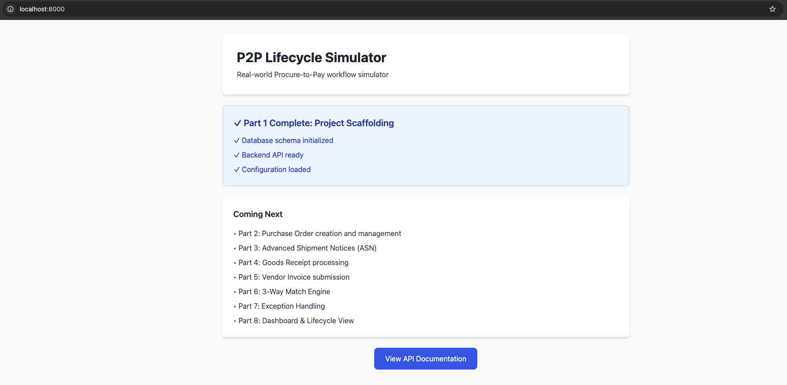
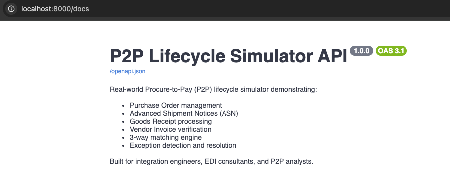
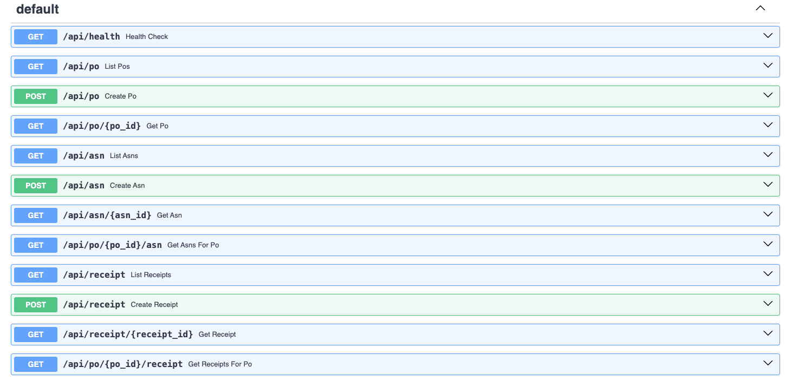

# Real-World P2P Lifecycle Simulator

> A business-realistic Procure-to-Pay workflow simulator demonstrating deep understanding of procurement operations, financial controls, and integration touchpoints across mid-market distribution, retail, and logistics operations.

---

## Project Purpose

This simulator models the **complete Procure-to-Pay (P2P) lifecycle** as it operates in real-world businesses—independent of any specific ERP platform. It demonstrates practical knowledge of:

- How companies manage vendor relationships and purchasing
- How goods flow from order to receipt to payment
- How financial controls prevent overpayment and fraud
- How exceptions are detected and resolved in AP workflows
- How data flows across purchasing, warehouse, and accounting systems

**This is not a toy demo.** It reflects the business logic, data structures, and operational discipline found in mid-market distributors, retailers, wholesalers, 3PLs, and importers.

---

## Who This Is For

### Target Industries
- **Distributors** managing high-volume SKU procurement
- **Retailers** balancing inventory buys with tight margin controls
- **Wholesalers** coordinating multi-vendor supply chains
- **3PLs** receiving goods on behalf of clients with strict verification requirements
- **Importers / Manufacturers** managing international shipments and invoicing complexity

### Relevant Roles
This project demonstrates competency for:
- **Integration Engineers** (EDI, API, middleware)
- **EDI Consultants** (850/856/810 mapping and business rules)
- **P2P Analysts** (procurement operations and exception management)
- **ERP Implementation Specialists** (business process configuration)
- **Fractional Consultants** supporting mid-market finance/supply chain teams

---

## Screenshots

### System Overview
Backend-driven Procure-to-Pay lifecycle simulator showing system readiness and workflow scope.



### API Overview
API-first P2P simulator designed for integration engineers, EDI consultants, and P2P analysts.



### Procurement Flow (PO → ASN → Receipt)
Endpoints demonstrating purchase order management, shipment notifications, and goods receipt processing.



### Invoice & Verification
Vendor invoice ingestion and verification endpoints supporting downstream 3-way match and exception logic.


---

## The P2P Lifecycle (What We Simulate)

The Procure-to-Pay process is the backbone of vendor payment integrity. This simulator covers all major steps:

### 1. **Purchase Order (PO) Creation**
   - Buyer creates a PO specifying products, quantities, prices, and delivery terms
   - PO is transmitted to the vendor (in real EDI workflows, this is an **850 transaction**)
   - Status: `Open`

### 2. **Vendor Ships Goods (ASN)**
   - Vendor prepares shipment and sends an **Advanced Shipment Notice (ASN)**
   - ASN includes SKU details, quantities shipped, tracking, and expected delivery
   - In EDI workflows, this is an **856 transaction**
   - Status: `In Transit`

### 3. **Goods Receipt (Warehouse Receiving)**
   - Warehouse receives the shipment and posts a **Goods Receipt (GR)**
   - Actual quantities and condition are recorded
   - PO status updates: `Partially Received` → `Received`
   - This creates the foundation for invoice verification

### 4. **Vendor Invoice Submission**
   - Vendor submits an invoice for payment
   - In EDI workflows, this is an **810 transaction**
   - Invoice includes line items with SKU, quantity invoiced, and prices
   - Status: `Pending` (awaiting verification)

### 5. **3-Way Match (Invoice Verification)**
   - System automatically compares:
     - **PO** (what was ordered)
     - **Receipt** (what was received)
     - **Invoice** (what the vendor is charging for)
   - Match criteria:
     - Quantity invoiced ≤ Quantity received (within tolerance)
     - Invoice price matches PO price (within tolerance)
   - **If match succeeds** → Invoice status: `Matched` → ready for payment
   - **If match fails** → Invoice status: `Blocked` → exception created

### 6. **Exception Handling**
   - Blocked invoices generate exceptions:
     - **Price Variance**: Invoice price differs from PO price beyond tolerance (e.g., >2%)
     - **Quantity Variance**: Invoice quantity differs from receipt quantity beyond tolerance (e.g., >5%)
     - **Missing Receipt**: Invoice submitted before goods received
     - **Over-Invoiced**: Vendor bills for more than was received
   - Exceptions are reviewed by AP/Procurement teams
   - Resolution options:
     - **Resolve**: Correct the data (adjust invoice, post additional receipt, etc.)
     - **Waive**: Approve the variance (with notes/approval)

### 7. **Payment & Closure**
   - Once matched or exceptions waived → Invoice status: `Approved`
   - Payment is processed (not simulated in this MVP)
   - Invoice status: `Paid`
   - PO status: `Closed`

---

## Why 3-Way Matching Matters

**3-way matching is the core financial control in P2P operations.**

Without it, companies risk:
- Paying for goods never received
- Paying incorrect prices
- Duplicate invoicing
- Vendor billing errors
- Fraudulent invoices

**How it works in practice:**

| Document | Data Point | Purpose |
|----------|-----------|---------|
| **Purchase Order** | Authorized price & quantity | What we agreed to pay |
| **Goods Receipt** | Actual quantity received | What we actually got |
| **Invoice** | Vendor's bill | What vendor is charging |

The system compares all three. Mismatches = blocked payment until resolved.

**Example Scenario:**
- PO: 100 units @ $10.00 = $1,000
- Receipt: 95 units received (5 damaged/missing)
- Invoice: 100 units @ $10.00 = $1,000

**Result:** Quantity variance exception → Invoice blocked → AP contacts vendor for credit memo or adjusted invoice.

This prevents overpayment and ensures tight financial controls.

---

## Technical Stack (and Why It's Lightweight)

This project intentionally uses a **minimal, transparent tech stack**:

| Component | Technology | Rationale |
|-----------|-----------|-----------|
| **Backend** | Python + FastAPI | Readable, widely understood, minimal boilerplate. FastAPI provides auto-documentation and modern async patterns. |
| **Database** | SQLite | Zero-config, portable, perfect for demonstrations. Shows schema design without deployment complexity. |
| **Frontend** | HTML + Tailwind CSS (CDN) + Vanilla JS | No build tools, no frameworks, no abstractions. Focus stays on business logic, not React state management. |
| **Data Format** | JSON | Industry-standard, human-readable, directly maps to EDI/API payloads. |

**Why not a full-stack framework?**
- This is a **business logic demonstration**, not a production SaaS product
- The goal is to show **P2P process knowledge**, not mastery of Next.js
- Lightweight = easy to read, easy to explain, easy to adapt
- Portfolio reviewers can clone, run, and understand in minutes

**This approach mirrors real integration work:**
- Integration engineers work with data structures, business rules, and APIs
- We translate between systems—understanding the business process matters more than UI polish

---

## Architecture Overview

### Modular Design
The system is organized into clear, separated concerns:

```
Purchase Orders ──→ Shipment Notices (ASN) ──→ Goods Receipts
                                                      ↓
                                              ┌──────────────┐
                                              │  3-Way Match │
                                              │    Engine    │
                                              └──────────────┘
                                                      ↓
Vendor Invoices ────────────────────────────→ Match Records
                                                      ↓
                                              ┌──────────────┐
                                              │  Exception   │
                                              │    Engine    │
                                              └──────────────┘
                                                      ↓
                                        Blocked Invoices / Resolutions
```

### Data Flow
1. **POs** define expectations
2. **ASNs** announce shipments (optional but realistic)
3. **Receipts** record actuals
4. **Invoices** trigger matching
5. **Match Engine** compares PO ↔ Receipt ↔ Invoice
6. **Exception Engine** detects and manages variances

### Business Rules Configuration
Tolerance thresholds are configurable (not hardcoded):
- Price variance tolerance: ±2%
- Quantity variance tolerance: ±5%

These reflect real-world AP policies.

---

## Features Demonstrated

### Core P2P Operations
- ✅ Purchase Order creation with line-item detail
- ✅ Advanced Shipment Notice (ASN) generation
- ✅ Goods Receipt posting with quantity verification
- ✅ Vendor Invoice ingestion
- ✅ Automatic 3-way matching (PO ↔ Receipt ↔ Invoice)
- ✅ Tolerance-based variance detection
- ✅ Exception blocking and resolution workflows
- ✅ Status tracking across the lifecycle
- ✅ Audit trail visibility

### EDI Concepts (Implicit)
While this is not an EDI parser, it reflects EDI document structures:
- PO → **850 Purchase Order**
- ASN → **856 Ship Notice/Manifest**
- Invoice → **810 Invoice**

The data models mirror how these documents are mapped in real integrations.

---

## What This Project Proves

This simulator demonstrates:

1. **Business Process Expertise**
   - Deep understanding of P2P workflows
   - Knowledge of financial controls and AP best practices
   - Awareness of distributor/retailer operational challenges

2. **Data Modeling Skills**
   - Clean, normalized relational schema design
   - Proper foreign key relationships
   - Realistic document structures

3. **Integration Thinking**
   - How data flows between purchasing, warehouse, and finance
   - How documents reference each other (PO ↔ ASN ↔ Receipt ↔ Invoice)
   - How exceptions interrupt automated workflows

4. **System Design**
   - Modular service architecture
   - Separation of business logic from presentation
   - Configurable rules and thresholds

5. **EDI-Adjacent Knowledge**
   - Understanding of 850/856/810 transaction purposes
   - Ability to translate business requirements into data structures
   - Readiness to work with EDI mapping and integration tools

---

## Quick Start

### Prerequisites
- Python 3.11+ (recommended: 3.12)
- Modern web browser

### Installation

### 1. Clone the repository
git clone https://github.com/itsbrianhughes/p2p-lifecycle-simulator.git
cd p2p-lifecycle-simulator

### 2. Create virtual environment
python3 -m venv venv
source venv/bin/activate  # On Windows: venv\Scripts\activate

### 3. Install dependencies
pip install -r requirements.txt

### 4. Run the application
python -m backend.main

### 5. Open your browser
 http://localhost:8000
 API docs: http://localhost:8000/docs


The application will:
- Create the SQLite database automatically
- Initialize all required tables
- Serve the frontend on `http://localhost:8000`
- Provide API documentation at `http://localhost:8000/docs`

---

## Project Structure

```
PROJECT-5-P2P-SIMULATOR/
├── backend/
│   ├── main.py                    # FastAPI app + routes
│   ├── database.py                # SQLite connection & initialization
│   ├── schemas.py                 # Database table definitions
│   ├── models.py                  # Pydantic data models
│   ├── config.py                  # Business rules & constants
│   └── services/                  # Business logic modules
│       ├── po_service.py          # Purchase Order operations
│       ├── asn_service.py         # Shipment Notice operations
│       ├── receipt_service.py     # Goods Receipt operations
│       ├── invoice_service.py     # Invoice operations
│       ├── match_engine.py        # 3-way matching logic
│       └── exception_engine.py    # Exception detection & handling
│
├── frontend/
│   ├── index.html                 # Dashboard home
│   ├── po.html                    # Purchase Orders UI
│   ├── asn.html                   # Shipment Notices UI
│   ├── receipt.html               # Goods Receipts UI
│   ├── invoice.html               # Vendor Invoices UI
│   ├── exceptions.html            # Exception Management UI
│   ├── lifecycle.html             # P2P Lifecycle View
│   └── js/                        # JavaScript modules
│
├── data/
│   └── p2p.db                     # SQLite database (auto-generated)
│
├── docs/
│   ├── ARCHITECTURE.md            # System design documentation
│   ├── BUSINESS_RULES.md          # P2P business logic explained
│   └── API.md                     # API endpoint documentation
│
├── requirements.txt               # Python dependencies
└── README.md                      # This file
```

---

## Use Cases

### As a Portfolio Project
- Demonstrates business process knowledge for integration/EDI roles
- Shows ability to translate real-world workflows into working systems
- Proves understanding of financial controls and exception handling
- Resume-ready talking points for interviews

### As a Learning Tool
- Study P2P workflows before an ERP implementation project
- Understand how 3-way matching works in practice
- Learn how EDI documents (850/856/810) relate to business processes
- Practice explaining procurement operations to non-technical stakeholders

### As a Demonstration
- Walk through the P2P lifecycle with real data
- Show how exceptions are created and resolved
- Illustrate integration touchpoints between systems
- Explain why certain data fields are required in EDI transactions

---

## Future Enhancements (Not in MVP)

This simulator focuses on core P2P logic. Potential extensions:

- **Actual EDI Parsing**: Ingest 850/856/810 X12 or EDIFACT files
- **Multi-Currency Support**: Foreign vendor invoicing
- **Payment Processing**: Check runs and remittance advice (820)
- **Returns & Credits**: Reverse logistics and credit memos
- **Approval Workflows**: Multi-level PO authorization
- **Reporting**: Aging reports, match rate analytics, vendor scorecards
- **Integration APIs**: Connect to actual ERP/accounting systems

---

## About This Project

This simulator was built to demonstrate **real-world P2P operations knowledge** for integration engineering, EDI consulting, and business process roles.

It reflects the kind of business logic, financial controls, and data flows that mid-market companies rely on every day—independent of any specific ERP vendor.

**Built by:** [Brian Hughes](https://github.com/itsbrianhughes/)
**LinkedIn:** [https://www.linkedin.com/in/b-hughes/](https://www.linkedin.com/in/b-hughes/)

---

## License

This project is provided as-is for educational and portfolio purposes.

---

## Acknowledgments

This project draws on real-world procurement operations observed across distribution, retail, and logistics industries. It is designed to be teaching-oriented, business-realistic, and integration-focused.

**Questions or feedback?** Open an issue or reach out directly.

---

**Ready to see P2P workflows in action? Run the simulator and explore the lifecycle.**
